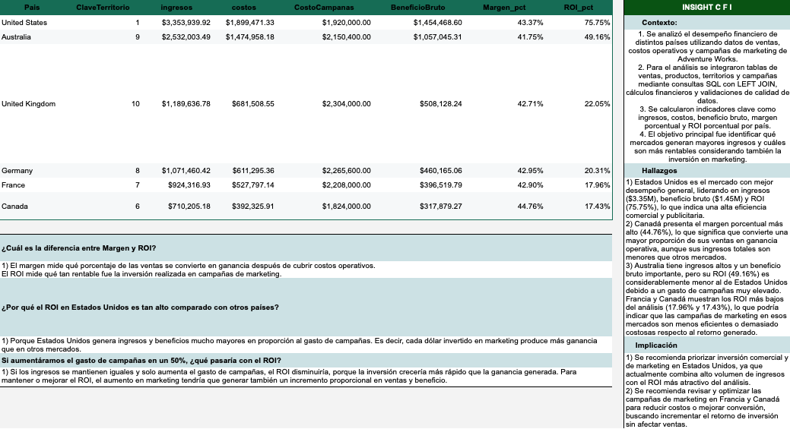

# Financial Performance Analysis with SQL

## 📌 Project Overview

This project analyzes a company's financial performance using SQL.

The objective was to transform raw transactional data into meaningful business metrics such as revenue, expenses, profit margin, and Return on Investment (ROI), supporting business decision-making through data analysis.

---

## 📸 Dashboard Preview

<p align="center">
  
</p>

---

## 🎯 Objectives

- Analyze financial performance across different countries.
- Calculate key business KPIs.
- Measure profitability.
- Calculate Return on Investment (ROI).
- Practice advanced SQL querying techniques.

---

## 🛠 Technologies

- SQL
- PostgreSQL
- Common Table Expressions (CTEs)
- JOINs
- Aggregate Functions
- CASE WHEN
- GROUP BY

---

## 📊 Key Analyses

- Revenue analysis
- Expense analysis
- Gross Profit calculation
- Profit Margin calculation
- ROI calculation
- Financial KPI reporting

---

## 📈 Results

The analysis identified the most profitable markets by comparing revenue, operational costs, marketing investment, profit margin, and ROI.

Key findings include:

- United States generated the highest revenue and ROI.
- Canada achieved the highest profit margin.
- Australia maintained strong profitability with moderate ROI.
- The project demonstrates how SQL can transform transactional data into actionable business insights for strategic decision-making.

---

## 📂 Repository Structure

```text
dashboard/
│── financial_performance_dashboard.xlsx

images/
│── dashboard-preview.png

README.md
```

---

## 👤 Author

**Roberto Blanco Lugo**

Data Analyst | SQL | Python | Power BI | Excel

LinkedIn:
https://www.linkedin.com/in/roberto-blanco-lugo-/
